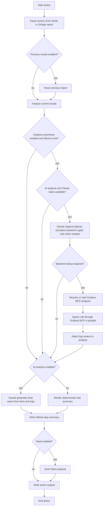

# Test Results Report Action

Analyze test failures and skips, write a GitHub Actions step summary, optionally compare against previous results, optionally run Claude failure analysis, and optionally notify Slack.

This action is additive. Existing users of `slack-test-notifications` can keep using it unchanged.

## Features

- Supports `ginkgo-json`, `junit`, and `playwright-json`
- Defaults to `format: auto`
- Writes a GitHub step summary by default
- Compares against previous results when `previous-results-path` is provided
- Reports new, recurring, and resolved failures/skips
- Sends Slack via incoming webhook
- Optionally adds concise Claude failure analysis grouped by failure pattern, without repeating the raw test tables
- Optionally enriches failures with related Loki logs fetched through Grafana MCP
- Fails open for Slack and Claude by default

## Basic Usage

```yaml
- name: Report test results
  uses: nscaledev/quality-tooling/.github/actions/test-results-report@main
  if: ${{ !cancelled() }}
  with:
    test-results-path: packages/e2e-console/test-results/results.xml
    format: junit
    title: E2E Test Results
    environment: dev
```

## Console E2E Style Usage

Place this after the Allure report URL is known.

```yaml
- name: Report E2E results
  uses: nscaledev/quality-tooling/.github/actions/test-results-report@main
  if: always() && (github.event_name == 'schedule' || github.ref == 'refs/heads/main')
  with:
    test-results-path: artifacts/test-results/results.xml
    format: junit
    title: E2E Test Results
    environment: ${{ needs.e2e-smoke-tests.outputs.target-env }}
    workflow-url: ${{ github.server_url }}/${{ github.repository }}/actions/runs/${{ github.run_id }}
    report-url: ${{ steps.report-url.outputs.url }}
    slack-webhook-url: ${{ secrets.E2E_SLACK_WEBHOOK_URL }}
    enable-ai-analysis: 'true'
    claude-token: ${{ secrets.CLAUDE_CODE_OAUTH_TOKEN }}
```

Pass `slack-webhook-url` and `claude-token` from GitHub secrets. The action masks both inputs before running the reporter, but callers should still avoid storing webhook URLs or Claude tokens in repository variables.

AI analysis shells out through `npx @anthropic-ai/claude-code`, so the runner must have Node.js/npm available.

## Processing Flow

At a high level, the action keeps orchestration inside the GitHub workflow runner:

1. Read the current test report from `test-results-path`.
2. Optionally read the previous report when `compare-with-previous` is enabled or auto-detected.
3. Analyze current failures, skips, deltas, and representative failures.
4. Optionally ask Claude which failures, if any, need backend log lookup.
5. Resolve or start Grafana MCP only when Claude planned backend queries, then query Loki in parallel.
6. Optionally run Claude to consolidate the final failure analysis.
7. Write the GitHub step summary.
8. Optionally send Slack.
9. Emit GitHub action outputs.



Grafana enrichment is fail-open from the report perspective. If Claude decides none of the failures need backend logs, the reporter skips Grafana entirely. If the MCP endpoint, datasource discovery, query planning, or Loki query fails, the action logs a warning and continues with the normal test report unless a lower-level workflow step fails before the reporter runs.

## Business Logic Contract

This section is the operating contract for maintainers and coding agents changing this action. Preserve these rules unless the product behavior is intentionally being changed.

### Source Of Truth

- Parsed test results are the source of truth for totals, failed tests, skipped tests, durations, and action outputs.
- Grafana data is supporting evidence only. It must not create failures, remove failures, or override the parsed test outcome.
- AI analysis is presentation and diagnosis only. It must not change counts, conclusions, comparison values, or Slack send status.
- If AI is disabled or unavailable, the action must still render a deterministic test summary.

### Parsing And Analysis

- `test-results-path` can be a file or directory. Directory mode recursively selects the newest supported `results.xml`, `junit.xml`, `results.json`, or `test-results.json`.
- Supported formats are `ginkgo-json`, `junit`, `playwright-json`, and `auto`.
- Ginkgo JSON preserves suite and spec start/end timestamps when present. Those timestamps are passed into AI analysis so timing claims can be checked against the Grafana query window.
- Skipped tests are reported as skipped. Intentional, known-bug, pending, disabled, or sentinel skips must not be classified as `test/false failure`.
- Previous-result comparison runs only when `compare-with-previous` is enabled or auto-detected from `previous-results-path`. Previous results are advisory comparison context; they do not change current run totals.

### Grafana Enrichment Gate

Grafana lookup is intentionally narrow and expensive setup is deferred:

1. Grafana enrichment must be enabled.
2. Current results must contain at least one failed test.
3. AI analysis and a Claude token must be available.
4. Claude must return at least one backend-related query in the strict JSON query plan.
5. Only then should the workflow resolve or start Grafana MCP and run Loki queries.

If any gate fails, the action continues without Grafana log context. Non-backend failures should not start Teleport, install `mcp-grafana`, or query Loki.

### Backend Query Planning

- Claude plans lookups per failure, using exact `failure_ref` values generated by the reporter.
- A single test suite can contain unrelated backend failures. Do not assume one backend component for a whole suite, especially for `nscale-ui` or other cross-component suites.
- Query plans must use read-only LogQL and must not include Grafana URLs. The reporter generates Grafana links after datasource, query, and time range are known.
- Planned queries are capped by `grafana-log-max-failures`; Loki execution is bounded by `grafana-log-concurrency`.
- Manual LogQL/template fallback is not part of the current production contract. Grafana lookup depends on AI planning so backend-only selection stays per failure.

### Time Window Rules

- `grafana-log-start` and `grafana-log-end` define an explicit query window.
- If `grafana-log-start` is omitted, the reporter uses `grafana-log-lookback` ending at report time.
- The final AI input includes the Grafana query window and, for Ginkgo reports, the test run/spec time ranges.
- Do not claim an error happened before the Grafana capture window unless the failed test actually began before that window.
- When a failed test is inside the Grafana window but Grafana returns only cleanup, audit, or activity rows, report that the provisioning/error signal was not present in the returned Grafana lines. The next check should point to resource creation or the pending-to-error transition inside the test window.

### Report Formatting

- GitHub summary should remain close to the existing production shape: totals, optional comparison, compact Grafana observations, then concise failure analysis.
- Do not render raw Loki rows, LogQL, search terms, exact failure metadata, Grafana debug output, or query-bearing URLs in the GitHub-facing summary.
- Grafana observations must stay compact: test, backend area, line count, components, and a neutral Grafana link when available.
- Final Claude analysis must merge Grafana evidence into the normal pattern table or next-check bullets. It must not add a separate Grafana/Loki section.
- Slack should remain short and actionable: grouped bullets plus one `Action` bullet. It should explicitly connect test error, AI interpretation, and Grafana signal when Grafana evidence is used.

### Fail-Open And Safety

- Slack sending is fail-open unless `fail-on-slack-error` is true.
- AI failure analysis errors are warnings, not action failures.
- Grafana planning, MCP startup, datasource discovery, and Loki query errors are warnings from the report perspective.
- Required input validation and current result parsing errors are real action errors.
- Secrets such as Slack webhooks, Claude tokens, and Grafana service account tokens must be masked before shelling out.
- Locally started `mcp-grafana` must use only datasource/Loki tools with writes disabled.

### Agent Change Checklist

When changing this action, update tests for the behavior being changed and run:

```bash
gofmt -w *.go
go test ./...
go test ./... -cover
git diff --check
```

For changes to final report wording, prompts, Grafana observations, or Slack formatting, replay or inspect a real failed run artifact before merging. The expected product behavior is a production-style test summary with only compact Grafana evidence added where it improves diagnosis.

## Grafana MCP Log Enrichment

Grafana log enrichment is opt-in. When it is enabled together with AI analysis, the action uses a two-pass flow: Claude first inspects the parsed test failures and returns a read-only Loki query plan for failures that look backend-related, the reporter executes those queries through Grafana MCP in parallel, then the retrieved log context is passed back into Claude for the final GitHub summary and Slack summary.

The action can either connect to an existing `mcp-grafana` streamable HTTP endpoint or start one itself. For Teleport-protected Grafana apps, the action uses a pinned `teleport-actions/application-tunnel` revision, which is compatible with GitHub bot identities. Do not use `tsh app login` in CI for this flow because bot identities cannot reissue app certificates.

Grafana decision logic:

| Condition | Behavior |
| --- | --- |
| `enable-grafana-log-enrichment` is not `true` | Skip Grafana entirely |
| No failed tests are present | Skip Grafana entirely |
| AI analysis is enabled and `claude-token` is available | Ask Claude to decide which failures, if any, need backend-related LogQL lookups |
| AI analysis or `claude-token` is unavailable | Log a warning and continue without Grafana log context |
| Claude returns no planned queries | Continue without Grafana log context |
| Claude query planning fails | Log a warning and continue without logs |
| Planned backend queries exist but no `grafana-mcp-endpoint` is available | Log a warning and continue without logs |
| Planned backend queries are ready | Execute `query_loki_logs` calls in parallel, bounded by `grafana-log-concurrency` |
| Loki returns matching lines | Add a compact Grafana observation to the GitHub summary and pass summarized Loki evidence into final Claude analysis |
| Loki returns no matching lines | Add a compact observation that no matching log lines were returned |

When Grafana enrichment is enabled, the action writes debug groups to the GitHub job log:

- `Grafana MCP enrichment preflight`: shows whether the token, app, direct URL, existing MCP endpoint, Grafana org ID, datasource selector, lookback, limit, max failures, and concurrency were configured. It also states the candidate setup path if backend queries are planned.
- `Grafana MCP query planning`: shows whether Claude selected backend-related failures, how many Loki queries were planned, and whether the workflow needs MCP setup.
- `Grafana MCP log enrichment`: shows the loaded query plan, selected Loki datasource, query time range, number of parallel query jobs, and each query's line count, truncation flag, first returned log line, or MCP/Loki error.

Teleport app access should remain narrow. The `github-grafana-access` bot is expected to use Teleport `app_labels` for Kubernetes-discovered Grafana apps, such as `app.kubernetes.io/name=grafana`, `teleport.dev/origin=discovery-kubernetes`, and the allowed cluster labels. It does not need broad Teleport dynamic-resource app rules for this action. Grafana read/query permissions must still come from the provided Grafana service account token; the action also starts `mcp-grafana` with write tools disabled and only datasource/Loki tools enabled.

Callers that let this action open the Teleport tunnel must grant `id-token: write`:

```yaml
permissions:
  contents: read
  id-token: write

steps:
- name: Report API results with Grafana logs
  uses: nscaledev/quality-tooling/.github/actions/test-results-report@main
  if: ${{ !cancelled() }}
  with:
    test-results-path: test/api/suites/junit.xml
    format: junit
    title: API Test Results
    environment: dev
    enable-ai-analysis: 'true'
    claude-token: ${{ secrets.CLAUDE_CODE_OAUTH_TOKEN }}
    enable-grafana-log-enrichment: 'true'
    grafana-service-account-token: ${{ secrets.GRAFANA_SERVICE_ACCOUNT_TOKEN }}
```

By default, the action uses datasource name `Loki`, a `2h` lookback, `20` log lines per query, `4` parallel Loki queries, and up to `6` failed tests for Grafana lookup. For Nscale Teleport-backed runs, it also infers `grafana-app` from `environment`: `dev` maps to `nks-dev-glo1-grafana`; `uat`, `stage`, and `staging` map to `nks-stg-europe-west2-grafana`.

Claude receives the failed test name, suite, location, error, captured output, environment, comparison context, and generated failure keyword regex. It returns JSON query plans like:

```json
{
  "queries": [
    {
      "failure_ref": "f1",
      "test_name": "uploads file",
      "backend_area": "file-storage",
      "expected_error": "POST /api/storage returned 500 for claim-123",
      "search_terms": ["claim-123", "file-storage", "500"],
      "logql": "{namespace=~\".+\"} |~ \"(?i)(claim-123|file-storage|500)\"",
      "reason": "The failed UI upload crossed the file storage API and includes a backend 500 signature, so Loki evidence can confirm whether file storage emitted the same error.",
      "confidence": "medium"
    }
  ]
}
```

The reporter executes each planned query through Grafana MCP's `query_loki_logs` tool. The GitHub summary shows only compact Grafana observations: test, backend area, line count, matched components, and a neutral Grafana link when available. Raw log rows, LogQL, search terms, exact failure metadata, and query-bearing Explore URLs stay out of the GitHub summary. The final Claude analysis receives summarized Loki evidence, including concrete signal text when available, so it can connect the test error to the backend observation without making the report verbose. Internally, when `grafana-url` is provided, or when `grafana-app` lets the wrapper infer the Teleport public Grafana URL, the reporter can generate an Explore URL for the exact datasource, LogQL, and time range; Claude is instructed not to invent Grafana URLs. If Claude decides no backend lookup is justified, it returns an empty query list and the report continues without Grafana logs.

For `nscale-ui` and other cross-component suites, the planner does not assume a single backend component. A single UI run can have unrelated failures caused by different backend components, such as Uni, identity, file storage, or console APIs. Claude chooses backend lookups per failure and may use a broad selector when the failure evidence does not identify one namespace or service. If `grafana-loki-datasource-uid` is omitted, the reporter uses Grafana MCP to discover the default or first Loki datasource, optionally filtered by `grafana-loki-datasource-name`.

## Previous Result Comparison

For MVP, previous results are read from a local path. The path can be a file or a directory. Directory mode recursively picks the newest supported result file named `results.xml`, `junit.xml`, `results.json`, or `test-results.json`.

```yaml
with:
  test-results-path: artifacts/test-results/results.xml
  previous-results-path: previous-artifacts/test-results/results.xml
  compare-with-previous: auto
```

When enabled, the report includes:

- new failures
- recurring failures
- resolved failures
- new skips
- recurring skips
- resolved skips
- pass/fail/skip deltas
- duration delta

## Inputs

| Input | Required | Default | Description |
| --- | --- | --- | --- |
| `test-results-path` | Yes | - | Current results file or directory |
| `format` | No | `auto` | `auto`, `ginkgo-json`, `junit`, `playwright-json` |
| `previous-results-path` | No | empty | Previous results file or directory |
| `previous-results-format` | No | current `format` | Format for previous results. Set to `auto` to detect independently |
| `previous-results-source` | No | `path` | Only `path` is currently supported |
| `compare-with-previous` | No | `auto` | Auto enables comparison when previous path is set |
| `write-step-summary` | No | `true` | Append markdown to `$GITHUB_STEP_SUMMARY` |
| `send-slack` | No | `auto` | Auto sends when `slack-webhook-url` is supplied |
| `slack-webhook-url` | No | empty | Incoming webhook URL |
| `fail-on-slack-error` | No | `false` | Fail action on Slack errors |
| `environment` | No | empty | Environment label |
| `branch` | No | `GITHUB_REF_NAME` | Branch shown in Slack |
| `actor` | No | `GITHUB_ACTOR` | Actor shown in Slack |
| `title` | No | `Test Results` | Report title |
| `workflow-url` | No | inferred | GitHub Actions workflow URL |
| `report-url` | No | empty | Published report URL, e.g. Allure |
| `max-failures` | No | `10` | Failure detail limit |
| `max-skips` | No | `10` | Skip detail limit |
| `include-skips` | No | `true` | Include skipped test details in summary |
| `enable-ai-analysis` | No | `false` | Run Claude analysis |
| `claude-token` | No | empty | Claude Code OAuth token |
| `enable-grafana-log-enrichment` | No | `false` | Fetch related logs through Grafana MCP |
| `grafana-service-account-token` | No | empty | Grafana service account token used when this action starts `mcp-grafana` |
| `grafana-app` | No | inferred from `environment` | Teleport Grafana app name used for the local tunnel |
| `grafana-url` | No | empty | Direct Grafana URL when no Teleport tunnel is needed; also used to generate neutral Grafana links |
| `grafana-org-id` | No | `1` | Grafana organization ID used by `mcp-grafana` and internal Explore URL generation |
| `grafana-teleport-proxy` | No | `nscale.teleport.sh:443` | Teleport proxy for the Grafana app tunnel |
| `grafana-teleport-token` | No | `github-grafana-access` | Teleport GitHub join token for the Grafana app tunnel |
| `grafana-tunnel-port` | No | `3000` | Local Grafana tunnel port |
| `grafana-mcp-version` | No | `v0.7.10` | Pinned `mcp-grafana` release tag to install |
| `grafana-mcp-port` | No | `8000` | Local `mcp-grafana` streamable HTTP port |
| `grafana-mcp-endpoint` | No | empty | Existing `mcp-grafana` streamable HTTP endpoint |
| `grafana-loki-datasource-uid` | No | empty | Loki datasource UID |
| `grafana-loki-datasource-name` | No | `Loki` | Loki datasource name used during discovery |
| `grafana-log-start` | No | empty | RFC3339 log query start time |
| `grafana-log-end` | No | empty | RFC3339 log query end time |
| `grafana-log-lookback` | No | `2h` | Lookback used when start time is omitted |
| `grafana-log-limit` | No | `20` | Maximum log lines per MCP query |
| `grafana-log-concurrency` | No | `4` | Maximum parallel Grafana MCP `query_loki_logs` calls |
| `grafana-log-max-failures` | No | `6` | Maximum failed tests queried with AI-planned queries |

## Outputs

The action emits counts and comparison values:

- `total`
- `passed`
- `failed`
- `skipped`
- `duration`
- `duration-ms`
- `conclusion`
- `new-failures`
- `recurring-failures`
- `resolved-failures`
- `new-skips`
- `recurring-skips`
- `resolved-skips`
- `slack-sent`

## Backward Compatibility

This action does not replace or change `slack-test-notifications`. Existing Ginkgo webhook consumers can continue using that action.

For new migrations, use this action. It preserves the old webhook model through `slack-webhook-url` while also supporting non-Ginkgo result formats.
