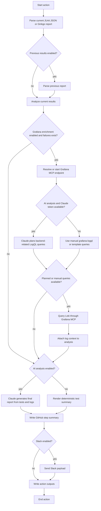

# Test Results Report Action

Analyze test failures and skips, write a GitHub Actions step summary, optionally compare against previous results, optionally run Claude failure analysis, and optionally notify Slack.

This action is additive. Existing users of `slack-test-notifications` can keep using it unchanged.

## Features

- Supports `ginkgo-json`, `junit`, and `playwright-json`
- Defaults to `format: auto`
- Writes a GitHub step summary by default
- Compares against previous results when `previous-results-path` is provided
- Reports new, recurring, and resolved failures/skips
- Sends Slack via incoming webhook
- Optionally adds concise Claude failure analysis grouped by failure pattern, without repeating the raw test tables
- Optionally enriches failures with related Loki logs fetched through Grafana MCP
- Fails open for Slack and Claude by default

## Basic Usage

```yaml
- name: Report test results
  uses: nscaledev/quality-tooling/.github/actions/test-results-report@main
  if: ${{ !cancelled() }}
  with:
    test-results-path: packages/e2e-console/test-results/results.xml
    format: junit
    title: E2E Test Results
    environment: dev
```

## Console E2E Style Usage

Place this after the Allure report URL is known.

```yaml
- name: Report E2E results
  uses: nscaledev/quality-tooling/.github/actions/test-results-report@main
  if: always() && (github.event_name == 'schedule' || github.ref == 'refs/heads/main')
  with:
    test-results-path: artifacts/test-results/results.xml
    format: junit
    title: E2E Test Results
    environment: ${{ needs.e2e-smoke-tests.outputs.target-env }}
    workflow-url: ${{ github.server_url }}/${{ github.repository }}/actions/runs/${{ github.run_id }}
    report-url: ${{ steps.report-url.outputs.url }}
    slack-webhook-url: ${{ secrets.E2E_SLACK_WEBHOOK_URL }}
    enable-ai-analysis: 'true'
    claude-token: ${{ secrets.CLAUDE_CODE_OAUTH_TOKEN }}
```

Pass `slack-webhook-url` and `claude-token` from GitHub secrets. The action masks both inputs before running the reporter, but callers should still avoid storing webhook URLs or Claude tokens in repository variables.

AI analysis shells out through `npx @anthropic-ai/claude-code`, so the runner must have Node.js/npm available.

## Processing Flow

At a high level, the action keeps orchestration inside the GitHub workflow runner:

1. Read the current test report from `test-results-path`.
2. Optionally read the previous report when `compare-with-previous` is enabled or auto-detected.
3. Analyze current failures, skips, deltas, and representative failures.
4. Optionally enrich failures with Grafana MCP logs.
5. Optionally run Claude to consolidate the final failure analysis.
6. Write the GitHub step summary.
7. Optionally send Slack.
8. Emit GitHub action outputs.



Grafana enrichment is fail-open from the report perspective: if the MCP endpoint, datasource discovery, query planning, or Loki query fails, the action logs a warning and continues with the normal test report unless a lower-level workflow step fails before the reporter runs.

## Grafana MCP Log Enrichment

Grafana log enrichment is opt-in. When it is enabled together with AI analysis, the action uses a two-pass flow: Claude first inspects the parsed test failures and returns a read-only Loki query plan for failures that look backend-related, the reporter executes those queries through Grafana MCP, then the retrieved log context is passed back into Claude for the final GitHub summary and Slack summary.

Without AI analysis, or when callers want additional fixed queries, the action can still run `grafana-logql` once for the report and `grafana-logql-template` once per representative failed test.

The action can either connect to an existing `mcp-grafana` streamable HTTP endpoint or start one itself. For Teleport-protected Grafana apps, the action uses `teleport-actions/application-tunnel@v1`, which is compatible with GitHub bot identities. Do not use `tsh app login` in CI for this flow because bot identities cannot reissue app certificates.

Grafana decision logic:

| Condition | Behavior |
| --- | --- |
| `enable-grafana-log-enrichment` is not `true` | Skip Grafana entirely |
| No failed tests are present | Skip Grafana entirely |
| No `grafana-mcp-endpoint` is provided and the action cannot start `mcp-grafana` | Log a warning and continue without logs |
| AI analysis is enabled and `claude-token` is available | Ask Claude for backend-related LogQL query plans first |
| Claude returns no planned queries and no manual queries are configured | Continue without Grafana log context |
| Claude query planning fails and manual queries are configured | Log a warning and run the manual queries |
| Claude query planning fails and no manual queries are configured | Log a warning and continue without logs |
| `grafana-logql` is provided | Run it once for the whole report |
| `grafana-logql-template` is provided | Render and run it once per representative failed test, capped by `grafana-log-max-failures` |
| Loki returns matching lines | Add query, reason, labels, and log lines to the GitHub summary and final Claude input |
| Loki returns no matching lines | Show the query and note that no matching log lines were returned |

Callers that let this action open the Teleport tunnel must grant `id-token: write`:

```yaml
permissions:
  contents: read
  id-token: write

steps:
- name: Report API results with Grafana logs
  uses: nscaledev/quality-tooling/.github/actions/test-results-report@main
  if: ${{ !cancelled() }}
  with:
    test-results-path: test/api/suites/junit.xml
    format: junit
    title: API Test Results
    environment: dev
    enable-ai-analysis: 'true'
    claude-token: ${{ secrets.CLAUDE_CODE_OAUTH_TOKEN }}
    enable-grafana-log-enrichment: 'true'
    grafana-service-account-token: ${{ secrets.GRAFANA_SERVICE_ACCOUNT_TOKEN }}
    grafana-app: nks-dev-glo1-grafana
    grafana-loki-datasource-name: Loki
    grafana-log-lookback: 2h
    grafana-log-max-failures: 6
```

In the AI-assisted flow, `grafana-logql` and `grafana-logql-template` are optional. Claude receives the failed test name, suite, location, error, captured output, environment, comparison context, and generated failure keyword regex. It returns JSON query plans like:

```json
{
  "queries": [
    {
      "failure_ref": "f1",
      "logql": "{namespace=~\".+\"} |~ \"(?i)(claim-123|file-storage|500)\"",
      "reason": "The UI file upload failed after the backend returned a storage claim error."
    }
  ]
}
```

The reporter executes each planned query through Grafana MCP's `query_loki_logs` tool and includes the query, reason, matching lines, and labels in the final report context. If Claude decides no backend lookup is justified, it returns an empty query list and the report continues without Grafana logs.

For manual fallback queries, `grafana-logql-template` runs once per representative failed test, up to `grafana-log-max-failures`. Use the selector part of the template to define the logs that are relevant to the test suite, and use `{{log_keywords_regex}}` to narrow each query to the individual failure. It supports these placeholders:

- `{{test_name}}`
- `{{test_suite}}`
- `{{test_file}}`
- `{{failure_message}}`
- `{{environment}}`
- `{{log_keywords_regex}}`

`{{log_keywords_regex}}` prioritizes UUID and trace-like identifiers from the failure message and captured test output before adding lower-signal words from the test name, suite, and file path.

For `nscale-ui` and other cross-component suites, prefer the AI-assisted flow above. If you also provide a manual fallback template, do not pin it to one backend namespace. A single UI run can have unrelated failures caused by different backend components, such as Uni, identity, file storage, or console APIs. Keep the LogQL selector broad enough to cover the backend services that can affect the UI, then let the per-failure keyword filter narrow the result:

```yaml
with:
  enable-grafana-log-enrichment: 'true'
  grafana-log-lookback: 2h
  grafana-log-max-failures: 6
  # Replace the namespace list with the backend namespaces used by the target environment.
  grafana-logql-template: '{namespace=~"unikorn-region|identity|file-storage|console-api"} |~ "(?i){{log_keywords_regex}}"'
```

You can also pass `grafana-logql` for one general query that runs once per report. If `grafana-loki-datasource-uid` is omitted, the reporter uses Grafana MCP to discover the default or first Loki datasource, optionally filtered by `grafana-loki-datasource-name`.

## Previous Result Comparison

For MVP, previous results are read from a local path. The path can be a file or a directory. Directory mode recursively picks the newest supported result file named `results.xml`, `junit.xml`, `results.json`, or `test-results.json`.

```yaml
with:
  test-results-path: artifacts/test-results/results.xml
  previous-results-path: previous-artifacts/test-results/results.xml
  compare-with-previous: auto
```

When enabled, the report includes:

- new failures
- recurring failures
- resolved failures
- new skips
- recurring skips
- resolved skips
- pass/fail/skip deltas
- duration delta

## Inputs

| Input | Required | Default | Description |
| --- | --- | --- | --- |
| `test-results-path` | Yes | - | Current results file or directory |
| `format` | No | `auto` | `auto`, `ginkgo-json`, `junit`, `playwright-json` |
| `previous-results-path` | No | empty | Previous results file or directory |
| `previous-results-format` | No | current `format` | Format for previous results. Set to `auto` to detect independently |
| `previous-results-source` | No | `path` | Only `path` is currently supported |
| `compare-with-previous` | No | `auto` | Auto enables comparison when previous path is set |
| `write-step-summary` | No | `true` | Append markdown to `$GITHUB_STEP_SUMMARY` |
| `send-slack` | No | `auto` | Auto sends when `slack-webhook-url` is supplied |
| `slack-webhook-url` | No | empty | Incoming webhook URL |
| `fail-on-slack-error` | No | `false` | Fail action on Slack errors |
| `environment` | No | empty | Environment label |
| `branch` | No | `GITHUB_REF_NAME` | Branch shown in Slack |
| `actor` | No | `GITHUB_ACTOR` | Actor shown in Slack |
| `title` | No | `Test Results` | Report title |
| `workflow-url` | No | inferred | GitHub Actions workflow URL |
| `report-url` | No | empty | Published report URL, e.g. Allure |
| `max-failures` | No | `10` | Failure detail limit |
| `max-skips` | No | `10` | Skip detail limit |
| `include-skips` | No | `true` | Include skipped test details in summary |
| `enable-ai-analysis` | No | `false` | Run Claude analysis |
| `claude-token` | No | empty | Claude Code OAuth token |
| `enable-grafana-log-enrichment` | No | `false` | Fetch related logs through Grafana MCP |
| `grafana-service-account-token` | No | empty | Grafana service account token used when this action starts `mcp-grafana` |
| `grafana-app` | No | empty | Teleport Grafana app name used for the local tunnel |
| `grafana-url` | No | empty | Direct Grafana URL when no Teleport tunnel is needed |
| `grafana-teleport-proxy` | No | `nscale.teleport.sh:443` | Teleport proxy for the Grafana app tunnel |
| `grafana-teleport-token` | No | `github-grafana-access` | Teleport GitHub join token for the Grafana app tunnel |
| `grafana-tunnel-port` | No | `3000` | Local Grafana tunnel port |
| `grafana-mcp-version` | No | `latest` | `mcp-grafana` release tag to install |
| `grafana-mcp-port` | No | `8000` | Local `mcp-grafana` streamable HTTP port |
| `grafana-mcp-endpoint` | No | empty | Existing `mcp-grafana` streamable HTTP endpoint |
| `grafana-loki-datasource-uid` | No | empty | Loki datasource UID |
| `grafana-loki-datasource-name` | No | empty | Loki datasource name used during discovery |
| `grafana-logql` | No | empty | Static LogQL query run once for the report, useful as a manual fallback or extra context |
| `grafana-logql-template` | No | empty | Manual per-failed-test LogQL template. For cross-component suites, prefer AI-assisted planning or keep the selector broad and let `{{log_keywords_regex}}` narrow each failure |
| `grafana-log-start` | No | empty | RFC3339 log query start time |
| `grafana-log-end` | No | empty | RFC3339 log query end time |
| `grafana-log-lookback` | No | `1h` | Lookback used when start time is omitted |
| `grafana-log-limit` | No | `20` | Maximum log lines per MCP query |
| `grafana-log-max-failures` | No | `3` | Maximum failed tests queried with the template |

## Outputs

The action emits counts and comparison values:

- `total`
- `passed`
- `failed`
- `skipped`
- `duration`
- `duration-ms`
- `conclusion`
- `new-failures`
- `recurring-failures`
- `resolved-failures`
- `new-skips`
- `recurring-skips`
- `resolved-skips`
- `slack-sent`

## Backward Compatibility

This action does not replace or change `slack-test-notifications`. Existing Ginkgo webhook consumers can continue using that action.

For new migrations, use this action. It preserves the old webhook model through `slack-webhook-url` while also supporting non-Ginkgo result formats.
